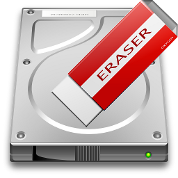

Title: Eliminar todas las particiones de una unidad de almacenamiento
Slug: dd-eliminar-todas-particiones-unidad-almacenamiento
Summary: Cómo usar el comando dd para eliminar todas las particiones de un disco duro, memoria externa o cualquier otro dispositivo de almacenamiento.
Tags: gnu linux
Date: 2018-09-26 17:45
Modified: 2018-09-26 17:45
Category: apuntes
Preview: preview.png

[DD](https://www.gnu.org/software/coreutils/manual/html_node/dd-invocation.html) forma parte de [Coreutils de GNU](https://www.gnu.org/software/coreutils/coreutils.html) y realiza copias desde un origen (*input*) a un destino (*output*), donde se puede especificar el tamaño de bloques y otras opciones de bajo nivel.

Las siguientes órdenes, que tiene que hacer como `root`, **son sumamente peligrosas porque pueden ocasionar la pérdidad de información.** Así que, antes de borrar todas las particiones de una unidad de almacenamiento, es recomendable que...

* **Siempre respalde periódicamente sus archivos más importantes.**
* Mantenga sus respaldos en **unidades desconectadas** de su equipo. El error más grave sería equivocarse de unidad de almacenamiento y ordenar borrar el disco de respaldo.
* **Identifique a la unidad principal, su disco de arranque con el sistema operativo y archivos,** la puede ser `/dev/sda`. No vaya a dañar su instalación en uso.

Verifique la **ruta que identifica al dispositivo** que tiene las particiones que desea eliminar. Cambie  `/dev/sdX` por `/dev/sdb`,  `/dev/sdc`, etc. hasta encontrarla.

    # fdisk -l /dev/sdX

Identifíquelo por su tamaño y particiones existentes. Revise de nuevo, un par de veces, no está demás ser doblemente cuidadosos.

Para eliminar todas las particiones, ejecute el comando `dd` cambiando `/dev/sdX` por la **ruta que identifica al dispositivo** y con los parámetros siguientes...

    # dd if=/dev/zero of=/dev/sdX bs=512 count=1

Verifique que se hayan eliminado las particiones...

    # fdisk -l /dev/sdc
