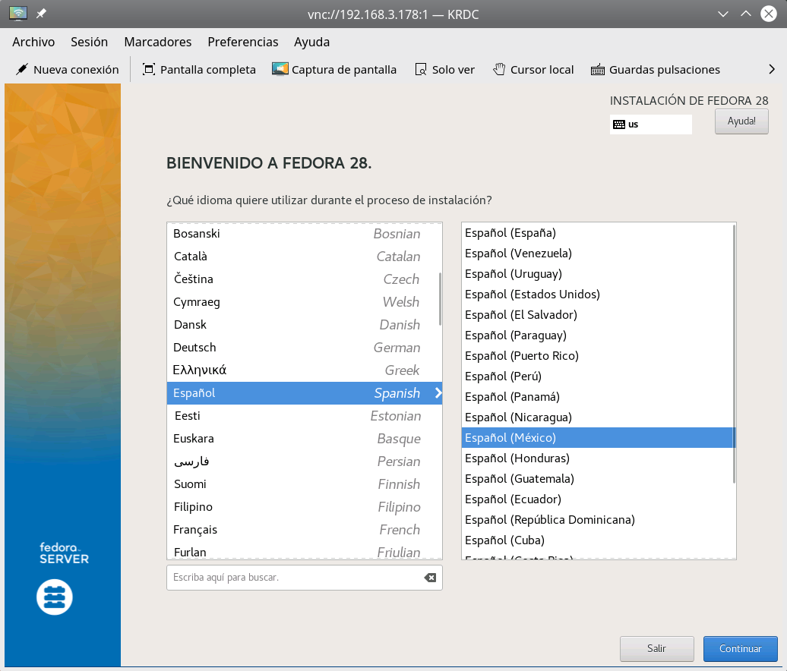
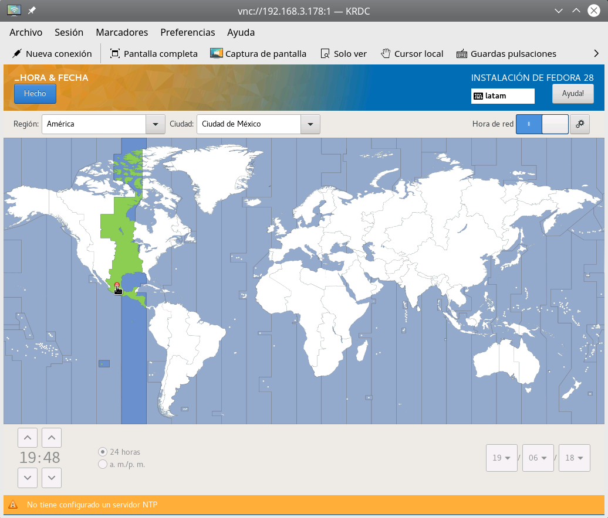
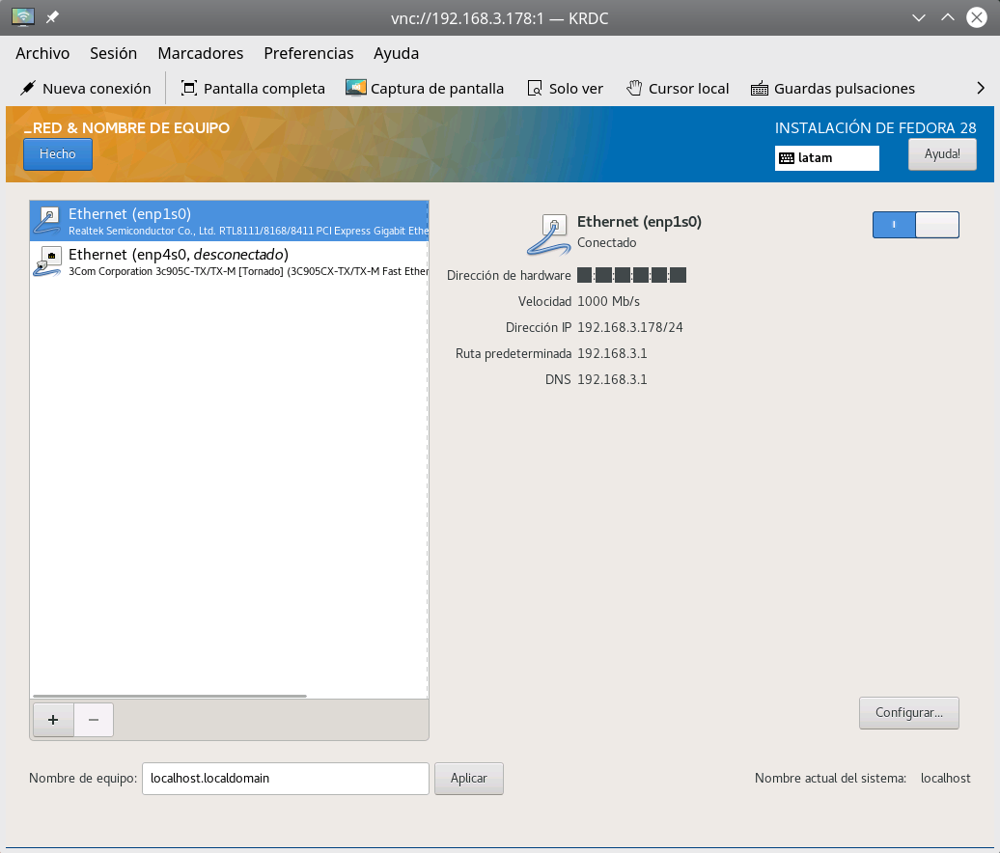
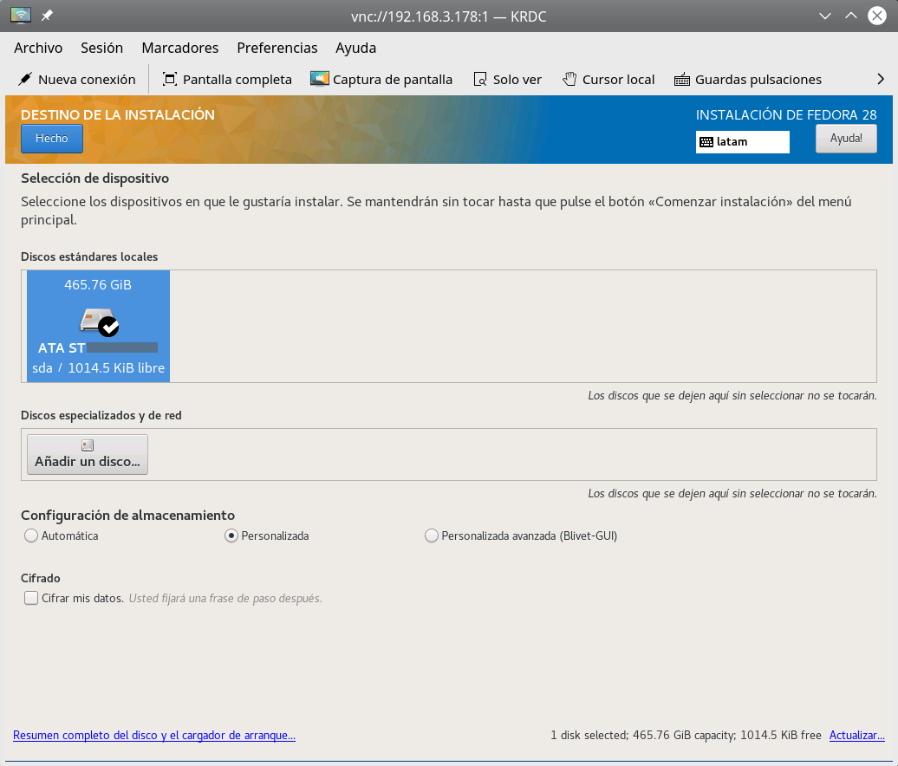
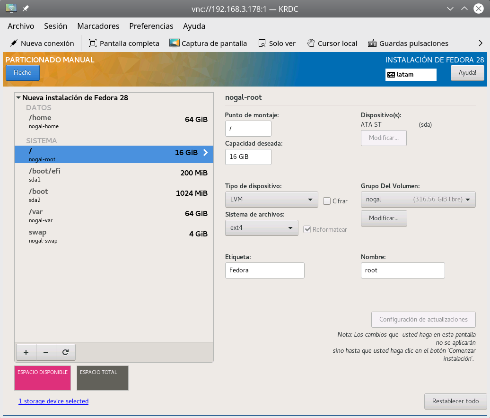
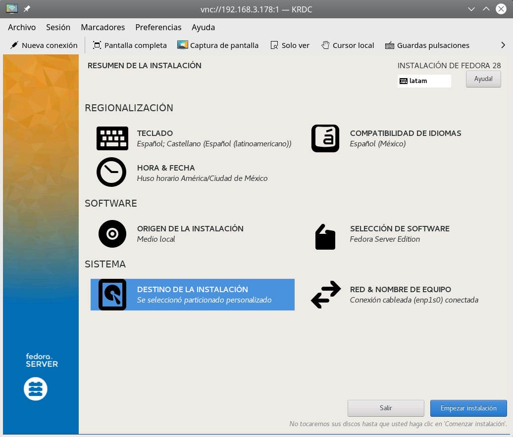
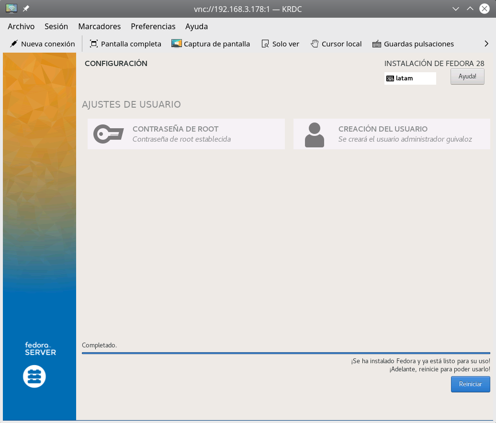

Title: Instalación de Fedora Server 28, parte 1, instalación
Slug: fedora-server-28-parte-01
Summary: Primeros pasos para la instalación de un servidor con Fedora Server 28.
Tags: fedora, gnu linux, servidores, software libre
Date: 2018-06-20 18:25
Modified: 2018-06-24 22:11
Category: apuntes
Preview: fedora-logo-icon.png

### Acerca de Fedora Server

[Fedora Server](https://getfedora.org/) es un sistema operativo GNU/Linux poderoso y flexible que incorpora las mejores y últimas tecnologías para servidores.

### Sobre esta serie de apuntes

Detallaré la instalación y configuración de un servidor que haga las funciones de DHCP, DNS, Proxy y servidor de archivos SAMBA para una red local.

* Parte 1, instalación. Justo la página en la que se encuentra.
* [Parte 2, configuración básica de red]({filename}/apuntes/fedora-server-28-parte-02/fedora-server-28-parte-02.md)
* [Parte 3, servicios DHCP y DNS]({filename}/apuntes/fedora-server-28-parte-03/fedora-server-28-parte-03.md)
* [Parte 4, muro de fuego para ruteador]({filename}/apuntes/fedora-server-28-parte-04/fedora-server-28-parte-04.md)
* [Parte 5, proxy Squid]({filename}/apuntes/fedora-server-28-parte-05/fedora-server-28-parte-05.md)
* [Parte 6, configuración del proxy en los clientes]({filename}/apuntes/fedora-server-28-parte-06/fedora-server-28-parte-06.md)
* [Parte 7, servidor de archivos SAMBA]({filename}/apuntes/fedora-server-28-parte-07/fedora-server-28-parte-07.md)

### ADVERTENCIA

**Es obvio que el procedimiento de instalación borrará los contenidos del disco duro y memoria USB que utilice.** Use componentes nuevos o que no tengan información que necesite.

Su servidor usó un *modesto* servidor que consta de una tarjeta madre *micro* con un procesador **Intel Celeron J1800** sin ventilador, tiene un dispositivo de red ethernet incorporado y una ranura PCI. Además de 2 GB de memoria RAM, un disco duro SATA de 500 GB y una segunda tarjeta de red ethernet. Así, un dispositivo de red se conectará al *modem* que brinda Internet y el otro a la red local.

El propósito de estos apuntes es contribuir a compartir el conocimiento del Software Libre sin ánimo de lucro. No me hago responsable por pérdidas, fallas o daños.

### Descarga y preparación

Para preprarar el medio de instalación vía USB [descargue Fedora Server](https://getfedora.org/es/server/download/) como un archivo ISO e inserte una memoria USB de una capacidad mayor al tamaño de ese archivo. Al momento de escribir este apunte, el archivo ISO es `Fedora-Server-dvd-x86_64-27-1.6.iso`

Ejecute `fdisk` como root para saber cuál dispositivo es la memoria USB...

    # fdisk -l

En mi caso es `/dev/sdc`

Para copiar el contenido ISO a la memoria USB y hacerla *booteable* ejecute como root...

    # dd if=Fedora-Server-dvd-x86_64-27-1.6.iso of=/dev/sdc status=progress

Sea paciente, toma buen tiempo. Al término asegure de no dejar partes sin copiar con...

    # sync

Extraiga la memoria USB e insértela en el nuevo servidor estando apagado.

### Instale remotamente

Es posible instalar a distancia vía VNC, para tomar imágenes y tener a la mano la documentación (como estos apuntes). Más detalles en [Installing using VNC](https://docs.fedoraproject.org/f27/install-guide/advanced/VNC_Installations.html#chap-vnc-installations)

1. Conecte el dispositivo de red ethernet que haya elegido para red local a la red local (vaya redundancia).
2. Encienda el equipo ordenando elegir el dispositivo USB como medio de carga del sistema. Por lo general se consigue presionando `F12` o `ESC`.
3. Cuando arranque GRUB presione `e` para editar y agregue `inst.vnc` en la línea que cargará el kernel linux.

Al terminar el arranque le mostrará en pantalla la dirección IP y el puerto para conectarse vía VNC. Elija el cliente VNC que prefiera, en estas imágenes se usó RNDC que es parte de KDE.

### Anaconda - Idioma

### Anaconda - Hora y fecha

### Anaconda - Red

Note que desde aquí se identifican los dos dispositivos de red.

### Anaconda - Destino

Elija el disco duro a donde instalar.

Y, como prefiero hacer las particiones *a mano*, activo la opción **Personalizada** de **Configuración de almacenamiento**.

Al presionar el botón **Hecho** cambiará a la pantalla de particionado.

### Anaconda - Particionado

Asigno 16 GB a la raíz de Fedora y separo `/var` a su propia partición de 16 GB. El área de intercambio `swap` puede ser *una y media* o *dos* veces la cantidad de memoria RAM instalada.

Un detalle adicional es modificar el **grupo del volumen** para que ocupe el tamaño máximo, es decir, que use todo el espacio que queda en el disco duro. Esto no significa que vayamos a ocupar todo el disco en este momento, sino que más adelante podamos crear nuevas particiones lógicas sin cambiar las volúmenes (consulte sobre **LVM**).

Por último, prefiero `ext4` como sistema de archivos en las particiones *root*, *var* y *home*.

### Anaconda - Resumen

Revise todo lo anterior y de clic en **Empezar instalación**.

### Anaconda - Instalación completada

Defina la contraseña de *root* y su cuenta de usuario.

Reinicie el equipo y retire la memoria USB para que arranque por primera vez Fedora Server.

### Ingrese remotamente vía OpenSSH

Edite `/etc/ssh/sshd_config` y active estas líneas para permitir que podamos accesar remotamente por `ssh`...

    ListenAddress 0.0.0.0

Reinice el daemon.

    # systemctl restart sshd

Tome nota de la dirección IP que tenga el servidor en la red local.

    # ip addr

E ingrese remotamente (cambie `192.168.n.m` por la dirección IP obtenida).

    $ ssh 192.168.n.m

### Actualice

Si usa un proxy agregue esa configuración a `/etc/dnf/dnf.conf` (cambie `proxy.redlocal.lan` por el nombre o dirección IP de su proxy).

    proxy=http://proxy.redlocal.lan:3128

Realice una actualización general, ejecute este comando como *root*.

    # dnf upgrade

Después de la actualización podría tener una nueva versión del kernel linux, así que reinice para que ya la use.

    # systemctl reboot

### Continuación...

[Vaya a la parte 2, configuración básica de red]({filename}/apuntes/fedora-server-28-parte-02/fedora-server-28-parte-02.md).
