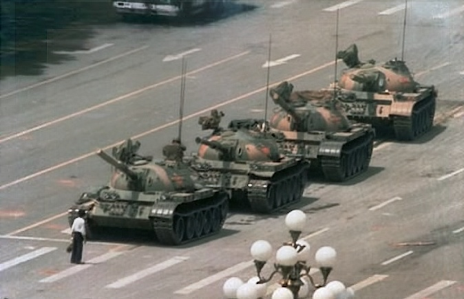

Title: Tank Man
Slug: tank-man
Summary: El 5 de junio de 1989, un hombre desconocido fue fotografiado y filmado cuando se paró frente a una fila de tanques de guerra que iban a la Plaza Tian'anmen, impidiendo por poco tiempo su avance.
Tags: política
Date: 2009-06-04 12:55
Modified: 2009-06-04 12:55
Category: articulos
Preview: preview.jpg

Hace veinte años, el 5 de junio de 1989, un [hombre desconocido](http://en.wikipedia.org/wiki/Tank_Man) fue [fotografiado](http://en.wikipedia.org/wiki/File:Tianasquare.jpg) y [filmado](http://www.youtube.com/watch?v=9-nXT8lSnPQ) cuando se paró frente a una fila de tanques de guerra que iban a la [Plaza Tian'anmen](http://es.wikipedia.org/wiki/Plaza_de_Tian%27anmen), impidiendo por poco tiempo su avance. Esto fue durante [las protestas de la Plaza de Tian'anmen de 1989](http://es.wikipedia.org/wiki/Protestas_de_la_Plaza_de_Tian%27anmen_de_1989) en Beijing, China.

> Las protestas acontecieron del 15 de abril al 4 de junio de 1989. Los manifestantes provenían de diferentes grupos, desde intelectuales que creían que el gobierno del Partido Comunista era demasiado represivo y corrupto, a trabajadores de la ciudad que creían que las reformas económicas en China habían ido demasiado lejos y que la inflación y el desempleo estaban amenazando sus formas de vida.
>
> Fuente: Wikipedia.

Esta fotografía fue tomada por Jeff Widener de _Associated Press_ desde el sexto piso del _Hotel Beijing_ a 800 metros de distancia. La imagen del hombre frente al tanque de guerra representa el fin de la Guerra Fría y se ha vuelto un símbolo de la protesta de la ciudadanía contra la opresión del gobierno.

La identidad de [Tank Man](http://en.wikipedia.org/wiki/Tank_Man) es incierta y su destino también. En YouTube hay un [documental](http://www.youtube.com/watch?v=SB70mWXrzEE) inspirado en este personaje.
