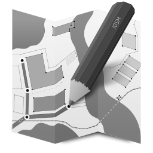

Title: Soluciones en software a la medida
Slug: soluciones
Summary: Soluciones para recolectar y analizar sus datos.
Date: 2017-12-27 22:20
Modified: 2017-12-27 22:20
Category: portafolio

### Administre y analize sus datos en la nube

  

    

      

        
        

          <h5 class="card-title">Google Cloud Platform</h5>
          
Sistemas a la medida en la nube más confiable y segura.

        

      

    

    

      

        
        

          <h5 class="card-title">GNU/Linux</h5>
          
Con las bondades del Software Libre protegerá su información.

        

      

    

    

      

        
        

          <h5 class="card-title">Gentoo Linux</h5>
          
Instalación de servidores con el GNU/Linux más veloz y eficiente.

        

      

    

  

  

    

      

        
        

          <h5 class="card-title">Python</h5>
          
Herramientas de datos e inteligencia artificial trabajando a su favor.

        

      

    

    

      

        
        

          <h5 class="card-title">PHP</h5>
          
Expertos en el lenguaje líder de los sistemas web.

        

      

    

    

      

        
        

          <h5 class="card-title">Geodata</h5>
          
Los datos georreferenciados son necesarios para la toma de decisiones.

        

      

    

  

### Misión

Desarrollar a la medida de las empresas, gobiernos y particulares,
los sistemas que administren, resguarden y analicen la información con
eficiencia, escalabilidad y disponibilidad.

### Visión

Automatizar los procesos vitales,
para asegurar la conservación de sus datos,
incrementando la creatividad y usando herramientas modernas.

### Valores

* Integridad
* Confianza
* Sencillez
* Versatilidad

### Para solicitar más información

Escríbanos a <sistemas@movimientolibre.com>
