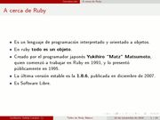
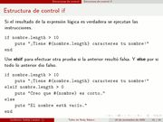
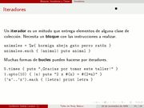

Title: Taller de Ruby Básico
Slug: ruby-basico-taller
Summary: Taller Básico de Ruby para conocer y practicar las bases de este relativamente nuevo lenguaje de programación que promete un gran futuro.
Tags: ruby
Date: 2009-11-22 23:55
Modified: 2009-11-22 23:55
Category: presentaciones
Preview: preview.jpg

Para el [Foro Académico Regional 2009](http://www.sistemasitl.com/foro2009/html/) en el [Instituto Tecnológico de la Laguna](http://www.itlalaguna.edu.mx/) su servidor impartió un Taller Básico de Ruby. Los asistentes conocieron y practicaron las bases de este relativamente nuevo lenguaje de programación que promete un gran futuro.

### Descargar

* [Presentación 354 KB](taller-de-ruby-basico.pdf)
* [Fuentes LaTeX 5 KB](taller-de-ruby-basico.tar.gz)
